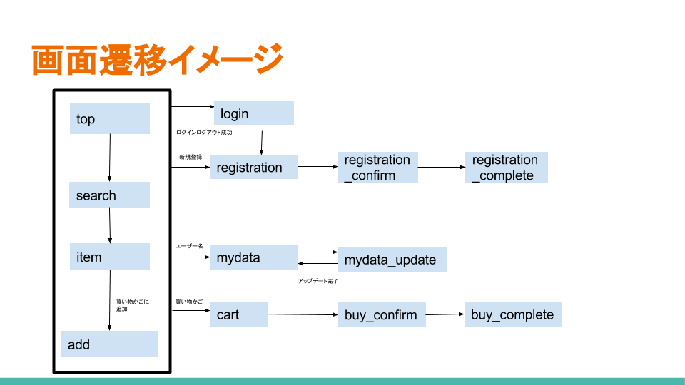

# PHP総まとめ

## 総まとめ
以下の内容を満たすサービスをPHPなどで制作しなさい　期限:一週間

サービス名:『かごいっぱいのゆめ』　(「kagoyume」という名前で新しいGithubリポジトリを作る)

### 概要　[参考サイト](http://www.yodobashi.com/)
　ショッピングサイトを使っている時、こんな経験ありませんか？　「あれいいな」「これいいな」「あっ、関連商品のこれもいい」「20%オフセールだって！？　買わなきゃ！」・・・そしていざ『買い物かご』を開いたとき、その合計金額に愕然とします。「こんなに買ってたのか・・・しょうがない。いくつか減らそう・・・」
　仕方がありません。無駄遣いは厳禁です。でも、一度買うと決めたものを諦めるなんて、ストレスじゃあありませんか？　できればお金の事なんか考えずに好きなだけ買い物がしたい・・・。このサービスは、そんなフラストレーションを解消するために生まれた『金銭取引が絶対に発生しない』『いくらでも、どんなものでも購入できる(気分になれる)』『ECサイト』です

### 要件
- 商品の検索や、結果の詳細から「買い物かごに追加」のできるECサイト
- ログイン、会員登録ができ、ログイン状態により画面表示＆遷移が若干変化する
- 商品の情報はYahooAPIを用いて取得する
- 買い物かごから購入画面へと遷移できる
- 実際に購入は出来ない(重要)


## YahooショッピングAPIについて
1. http://developer.yahoo.co.jp/にアクセスして、デベロッパーアカウントを取得(yahooIDを取得している必要あり)
2. デベロッパーネットワークトップ > アプリケーションの管理 > 新しいアプリケーションを開発　とアクセスし、アプリケーションの種類に「サーバーサイド」を選択。他は適当に入力しても構わない。規約に同意し、続行。アプリケーションIDが入手できます(以後いつでも確認できる)。
3. PHPにおけるショッピング検索APIについては[こちら](http://developer.yahoo.co.jp/sample/shopping/sample1.html)を参照してください。サンプルコードはほぼそのまま使用できます。


## 画面遷移イメージ


## ディレクトリ構成
```
┣━app
┃　┣━top.php
┃　┣━search.php
┃　┣━item.php
┃　┣━add.php
┃　┣━login.php
┃　┣━registration.php
┃　┣━registration_confirm.php
┃　┣━registration_complete.php
┃　┣━mydata.php
┃　┣━mydata_update.php
┃　┣━・・・・・
┃　┣━buy_confirm.php
┃　┗━buy_complete.php データの挿入、検索などの操作を行える画面をまとめたディレクトリ。このサービスの根幹
┗━util
　　┣━scriptUtil.php
　　┣━dbaccessUtil.php
　　┗━defineUtil.php utilディレクトリには共通処理をまとめたscriptUtilと、データベースへのアクセスをまとめたdbaccess、共通で用いる定数をまとめたdefineUtilを、ユーティリティ(便利)フォルダとしてまとめておく
```

## 各ファイルの詳細
### 仕様
- 全てのページに、「ログイン」を表示。ログイン済みの場合、「ログイン」の代わりに「ログアウト」「買い物かご」を、さらに「ようこそ(ユーザー名[クリック可能])さん！」を表示。

- top.php
    - トップページ。ルートはここである
    - このシステムの簡単な説明が記載されている。テキストは自由
    - キーワード検索フォームが設置されている。検索の遷移先はsearchで、GETメソッド。未入力ならエラーを表示
- search.php
    - 検索結果ページ
    - topから検索により遷移できる。YahooショッピングAPIに直接検索キーワードを渡し、その結果を受け取り＆表示している
    - 検索キーワード、検索結果数を表示
    - 縦のリスト型に表示。サムネイルと、その横に商品名、金額が載っている。クリックでitemへ
    - 結果は上位10件まで
- item.php
    - 商品詳細ページ
    - serchまたはcartから遷移できる。商品IDをGETメソッドにより受け渡す
    - YahooショッピングAPIから取得したデータで、より詳細な情報(概要や評価値)、が表示される
    - 「カートに追加する」ボタンがあり、クリックするとadd.phpに遷移する。
- add.php
    - カートに追加ページ
    - 商品の情報を受け取り、クッキーやセッションに追加する
    - 画面には「カートに追加しました」という文言が出てくる。
- login.php
    - ログイン管理ページ
    - どのページからも遷移できる。ログインしているかいないかで処理が分岐する
    - ログインしていない状態(各ページの「ログイン」というリンクから)で遷移してきた場合は、ユーザー名とパスワードを入力するフォームが表示される。また、「新規会員登録」というリンクも表示される。
    - ログインに成功すると、その情報をログイン状態を管理できるセッションに書き込み、そのまま直前まで閲覧していたページに遷移する
    - ログインしている状態で(各ページの「ログアウト」というリンクから)遷移してきた場合は、ログアウト処理を行う(セッションの破棄、クッキーに保存されたセッションIDを破棄)その後topへ
    - ユーザーデータの削除フラグが1の場合は削除されたユーザーとして処理すること
- registration.php
    - 新規会員登録ページ
    - loginからのみ遷移
    - フォームがあり、入力するのは以下の要素
    - ユーザー名、パスワード、メールアドレス、住所
    - registration_confirmから戻ってきた場合は、値を保持して記入済みにできる
- registration_confirm
    - フォームで入力された文字や選択を表示し、「上記の内容で登録いたします。よろしいですか？」と表示。「はい」でregistration_complete「いいえ」でregistrationに値を保持したまま(戻った時にフォーム入力済みになっている)遷移
    - もし不足していた場合はどの項目のデータが不足しているのかを表示。insertに値を保持したまま遷移するリンクを表示
- registration_complete.php
    - プロフィール用のDBに値を挿入。この際、現在時(年日時分)を組み込み関数で取得し、追加。
    - 「以上の内容で登録しました。」とregistration_confirmのようにフォームで入力された値を表示
    - 「トップページへ戻る」のリンクが、目立つ場所に設置されている
- cart.php
    - 「カートに追加」でクッキーやセッションに保存された登録情報が登録古い順に表示される
    - 商品の写真と名前(リンクつき)、金額を表示。
    - 画面下部に全額の合計金額を表示する
    - 「購入する」ボタンあり
    - 各商品には「削除」のリンクあり。このリンクをクリックすることで、カートから商品を削除する
    - カートの中身はユーザー毎に切り替えられる
    - ログインしていない状態ならばログインページに遷移、そこでログインに成功した場合、非ログイン状態で「カートに追加」操作をしていた商品はそのユーザー用のカートに移る
- buy_confirm.php
    - 購入確認ページ
    - カートに追加順で商品の名前(リンクなし)、金額が表示される
    - 合計金額が表示され、その下に発送方法を選択するラジオボタンがある。
    - 「上記の内容で購入する」ボタンと「カートに戻る」ボタンがある。
- buy_complete.php
    - 購入完了ページ
    - 購入データを保存
    - 総購入金額を更新
    - 「購入が完了しました」と表示
- my_data.php
    - 登録したユーザー情報が閲覧できる(ユーザーID以外全て)
    - 購入履歴へのリンクあり
    - 登録情報を更新する、削除するリンクあり
- my_history.php
    - これまで購入した商品の履歴が見れる
- my_update.php
    - フォームから入力するデータで既にあるデ.ータを更新できる
    - 画面構成はregistration.phpと同じ。フォーム内に直接記入された状態である。このフォームの内容を書き換えていくことでデータの更新ができる
    - 送信ボタン付き
- my_update_result.php
    - IDなどを受け取り、DBを更新。
    - 「以上の内容で更新しました。」と、フォームで入力された値を表示
- my_delete.php
    - ユーザー削除確認ページ
    - 対象のレコードの全データを表示したのちに、「このユーザーをマジで削除しますか？」という質問があり、「はい」と「いいえ」が直リンクとして設置してある。「はい」ならmy_delete_result.phpへ、そうでないならトップページへ遷移する
- my_delete_result.php
    - ここにアクセスした段階で、IDによる削除が実行される(外部キー制約により直接DELETEは出来ないので、削除フラグを0から1に変更する)
    - 「削除しました｝という一文が表示される

- scriptUtil.php
    - よく使うユーザー定義関数をまとめておく
    - 例えば、トップへのリンクを挿入する処理をまとめておけば、すべてのページでこのリンクを使用するときにそのユーザー定義関数を挿入するだけでよくなる
- dbaccessUtil.php
    - データベースアクセス系のユーザー定義関数を格納する
- defineUtil.php
    - システム内で使われる具体的な定数(topページなどのURLや、MySQPユーザー名、パスワード)などをまとめて定義しておく場所。ここで定義しておき全.phpでrequireすれば、いちいち変数を宣言する必要がなくなる
    - const $~~=・・・; という表記のみが記述されている。

## DBの構成
今回のテーブルは2つ。kagoyume_dbとテーブルをcreateしておく必要がある

テーブル名:user_t　ユーザー情報管理テーブル。初回の登録や更新以外に、購入時には総購入金額が更新

|カラム名| userID                     | name         | password     | mail         | address | total    | newDate  | deleteFlg  |
|--------|----------------------------|--------------|--------------|--------------|---------|----------|----------|------------|
| 論理名 | ユーザID                   | ユーザー名   | パスワード   |メールアドレス| 住所    |総購入金額| 登録日時 | 削除フラグ |
|データ型|int(主キー／AUTO_ INCREMENT)| varchar(255) | varchar(255) | varchar(255) | text    | int      | Datetime |int(初期値0)|

テーブル名:buy_t　購入管理テーブル。1度の購入につき購入する商品の個数分生成される

|カラム名| buyID                     | userID      | itemCode     | type   | buyDate  | 
|--------|---------------------------|-------------|--------------|--------|----------| 
| 論理名 | 購入ID                    | ユーザーID  | 商品コード   |発送方法| 購入日時 | 
|データ型|int(主キー／AUTO_INCREMENT)|int(外部キー)| varchar(255) | int    | Datetime | 


## 効率の良い作成順序
ざっくりと作ってしまってからクオリティを高めていく方式がよい
ではその『ざっくり』とはどういう事かというと...

　_**システムの中心となる機能を見抜き**_
　**_それの実装を最短で行う。他は最低限でもよい_** ということ

今回のシステムで必ず実装しなければならないメイン機能
- 指定した情報を検索表示する機能
- カートに入れたアイテムを「購入」できる機能
この二つがないとECサイトとは呼べないため

他の細かいサポート機能は後から少しずつ足していけばよい
※ただしutilファイルに共通化できる処理や定数を切り分けておくのは最初から意識して行うこと

1. システムの中心部分の流れを作る
2. システムの中心機能を実装する
3. 全ての画面遷移を用意する
4. 残った細かな機能を実装する
5. クオリティアップを図る
